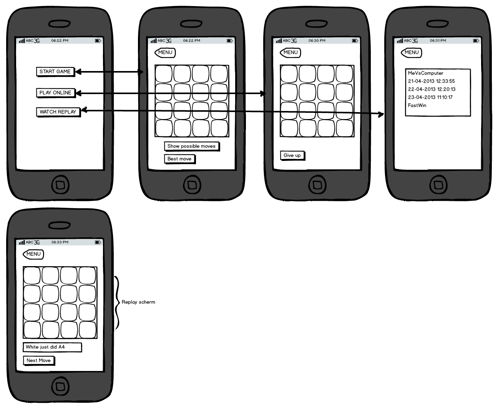

# Othello

Een android app waarmee je het bordspel Othello kan spelen.

Gemaakt voor de UvA minor programmeren.

# Features

* Othello spelen tegen de computer
* Othello spelen tegen een tegenstander
* Replay opslaan na het spelen
* Replay bekijken
* Vragen om een hint tijdens het spelen

# Tools

* Java
* Android
* Eclipse

# Tasks

* Othello gameplay - Sebastiaan
* Replay opslaan / bekijken - Marten
* Online spelen - Sebastiaan / Marten
* User Interface - Sebastiaan / Marten

# Mockup

